<div align="center">

<!-- HEADER -->


</div>

<br>

<div align="center">

[](https://git.io/typing-svg)

</div>

<br>

---

## 👨‍💻 Sobre mí

```js
const giovanni = {
  rol:        "Desarrollador de Software",
  enfoque:    ["Desarrollo Web", "Backend", "Bases de Datos"],
  tecnologías: ["PHP", "Python", "Java", "JavaScript", "MySQL"],
  herramientas: ["Git", "GitHub", "VS Code", "Figma", "XAMPP"],
  objetivo:   "Seguir aprendiendo y construir soluciones de calidad 🚀"
};
```

<br>

---

## 🧰 Stack Tecnológico

<div align="center">

### ⚙️ Backend


### 🎨 Frontend


### 🗄️ Base de Datos


### 🛠️ Herramientas


</div>

<br>

---

## 💣 Proyectos Destacados

<table>
<tr>

<td width="50%" valign="top">

### 🔍 Sistema de Objetos Perdidos

<div align="center">
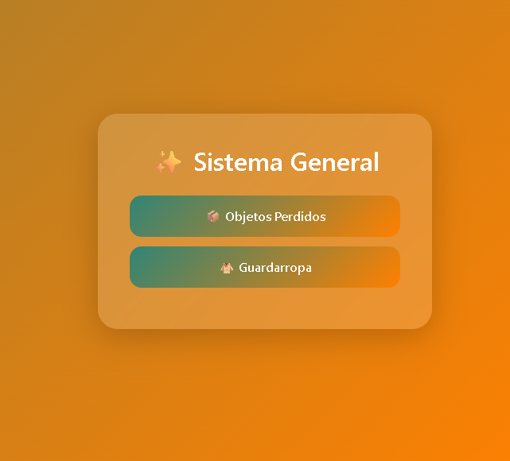
<br><br>
<table>
<tr>
<td>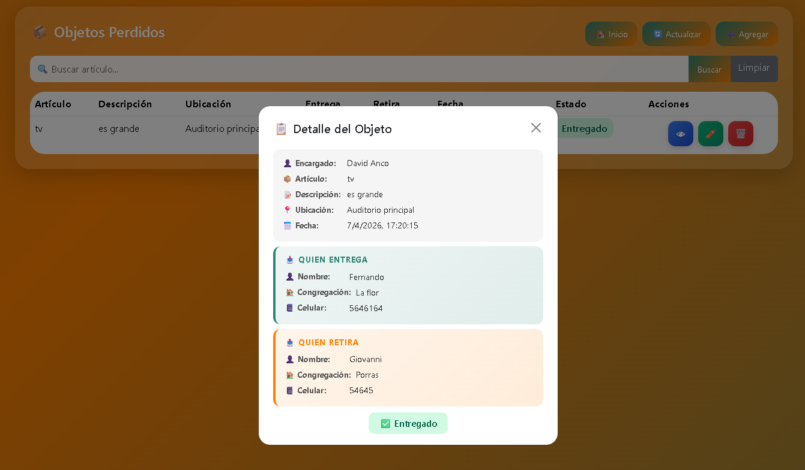</td>
<td>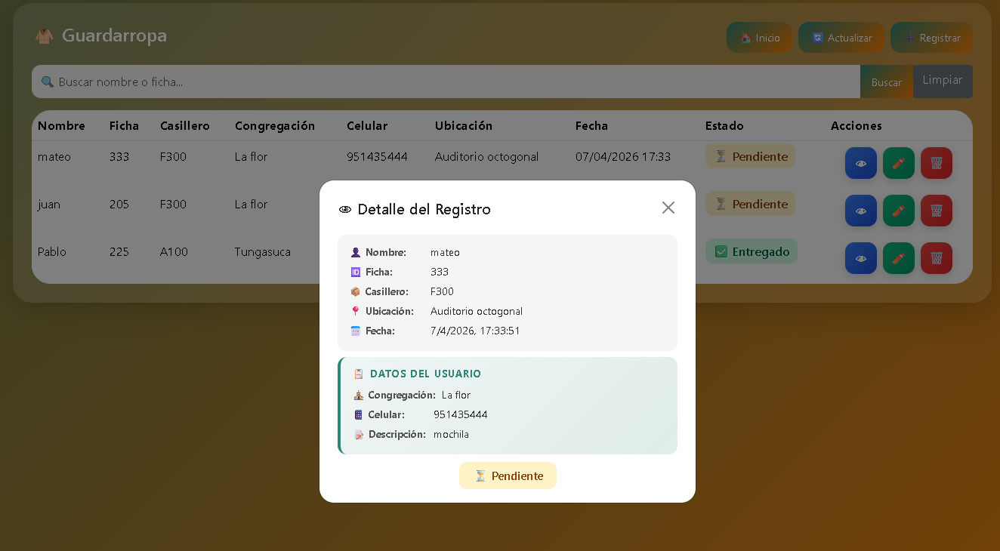</td>
</tr>
</table>
</div>

<br>

> Sistema web desarrollado para la gestión de objetos perdidos con interfaz intuitiva y conexión a base de datos.

**✅ Funcionalidades:**
- 📝 Registro de objetos perdidos
- 🔎 Búsqueda por nombre o categoría
- ⚙️ CRUD completo (crear, editar, eliminar)
- 📱 Interfaz responsive con Bootstrap
- 🗃️ Conexión a base de datos

<br>

**🛠️ Stack:**


<br>

<div align="center">
<a href="#">
  
</a>
</div>

</td>

<td width="50%" valign="top">

### 🔧 Taller Automotriz

<div align="center">
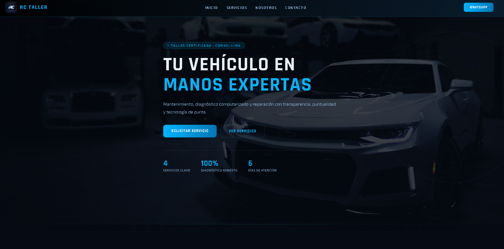
<br><br>
<table>
<tr>
<td>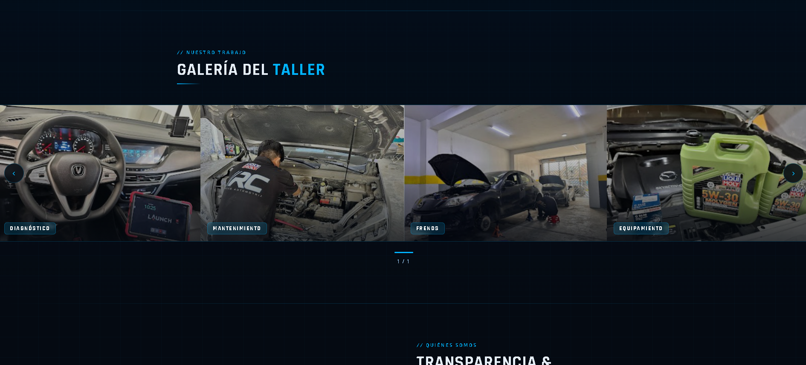</td>
<td>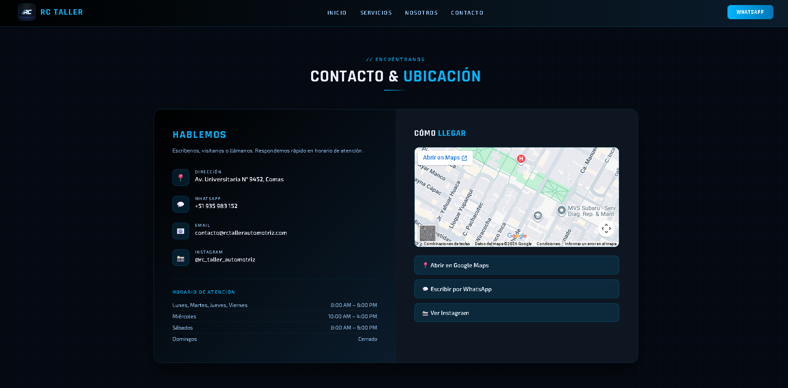</td>
</tr>
</table>
</div>

<br>

> Plataforma web completa para la administración de un taller mecánico, clientes y órdenes de trabajo.

**✅ Funcionalidades:**
- 👤 Registro de clientes y vehículos
- 🔩 Gestión de servicios y reparaciones
- 📅 Control de citas y órdenes de trabajo
- 📱 Interfaz intuitiva y responsive

<br>

**🛠️ Stack:**


<br>

<div align="center">
<a href="#">
  
</a>
</div>

</td>

</tr>
</table>

<br>

<table>
<tr>

<td width="50%" valign="top">

### ✈️ Sistema de Vuelos

<div align="center">
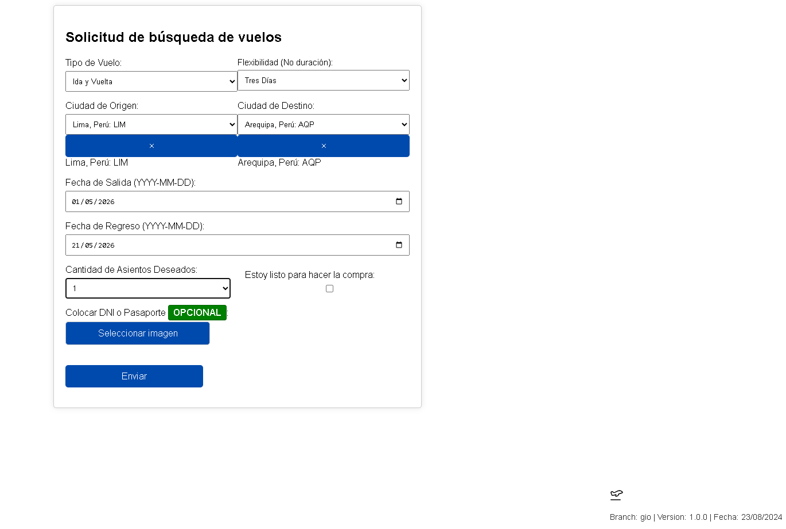
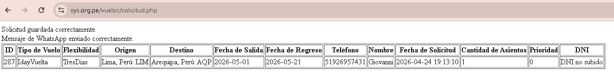
</div>

<br>

> Plataforma web para registro de solicitudes de vuelo conectada a base de datos en tiempo real.

**🛠️ Stack:**


<br>

<div align="center">
<a href="#">
  
</a>
</div>

</td>

<td width="50%" valign="top">

### 📋 Gestión de Proyectos

<div align="center">
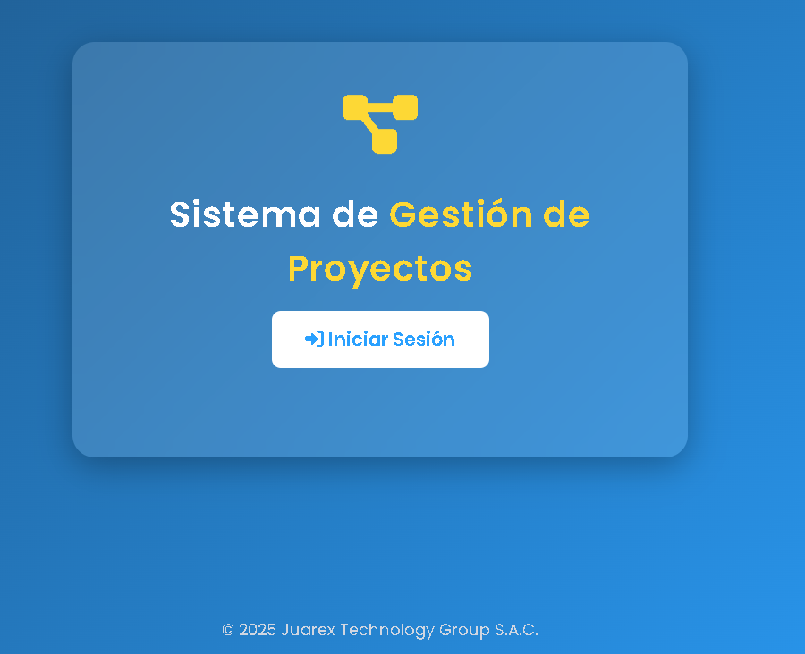
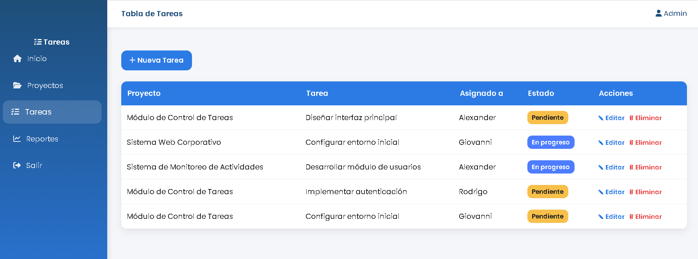
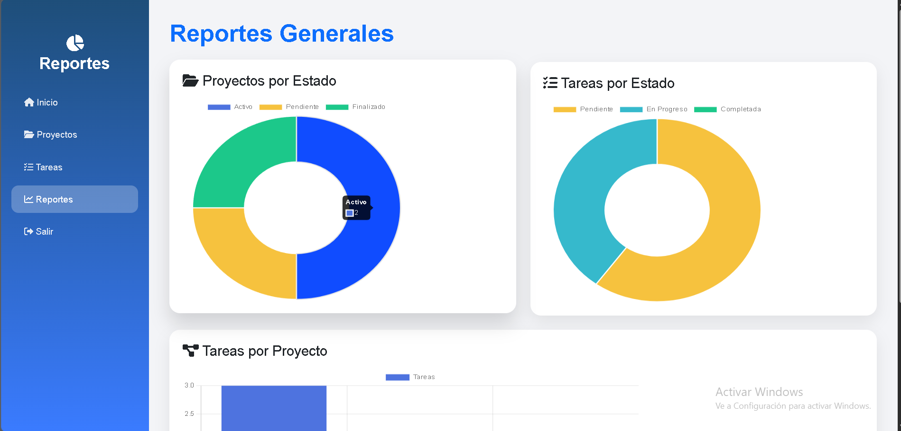
</div>

<br>

> Sistema integral de gestión con operaciones CRUD, búsqueda avanzada y arquitectura optimizada.

**✅ Funcionalidades:**
- ⚙️ CRUD completo (crear, editar, eliminar)
- 🔎 Búsqueda avanzada por múltiples criterios
- 📱 Interfaz moderna y responsive
- 🗃️ Integración robusta con base de datos
- ⚡ Estructura optimizada para rendimiento ágil

**🛠️ Stack:**


<br>

<div align="center">
<a href="#">
  
</a>
</div>

</td>

</tr>
</table>

<br>

---

## 📊 GitHub Stats

<div align="center">


</div>

<div align="center">

[](https://git.io/streak-stats)

</div>

<br>

---

## 📞 Contacto

<div align="center">

[](tel:+51926957431)
[](mailto:giom67914@gmail.com)
[](https://github.com/Giovanni11-pe)

</div>

<br>

---

<div align="center">


⭐ **Si te gusta mi trabajo, ¡sígueme en GitHub!**

</div>
